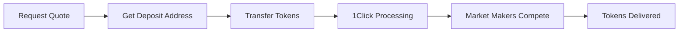

import { Callout } from 'nextra/components'

# Bridge & Cross-chain Features

PotLaunch integrates with [NEAR Intents](https://docs.near-intents.org/near-intents/) to provide seamless cross-chain token transfers and swaps. NEAR Intents is a multichain transaction protocol where users specify desired outcomes and let third parties (Market Makers) compete to provide the best solution.

## Overview

NEAR Intents enables:
- **Cross-chain token swaps** - Exchange tokens between different blockchains
- **Competitive pricing** - Market Makers compete to offer the best rates
- **Automatic settlement** - Smart contracts verify and settle all transactions
- **Wide chain support** - Support for multiple blockchains including NEAR, Ethereum, Solana, and more

## Using NEAR Intents for Deposits

NEAR Intents simplifies cross-chain deposits through the **1Click Swap API**, which abstracts away the complexity of intent creation, solver coordination, and transaction execution.

### How 1Click Works

The 1Click API provides a simple REST interface for cross-chain swaps:

1. **Request a Quote** - Get the best available rate with a unique deposit address
2. **Transfer Tokens** - Send tokens to the provided deposit address
3. **Automatic Processing** - 1Click coordinates with Market Makers to execute your swap
4. **Receive Tokens** - Get tokens delivered to your specified address

### Swap Process Flow



### Supported Tokens

To check which tokens are supported for cross-chain transfers, use the tokens endpoint:

```bash
GET https://1click.chaindefuser.com/v0/tokens
```

Each token includes:
- Blockchain network
- Contract address
- Current price in USD
- Symbol and decimals
- Last price update timestamp

## Bridging Tokens with 1Click API

### Step 1: Request a Swap Quote

Request a quote by providing swap parameters:

```typescript
POST https://1click.chaindefuser.com/v0/quote

{
  "dry": false,
  "swapType": "EXACT_INPUT",
  "slippageTolerance": 100, // 1% = 100 basis points
  "originAsset": "nep141:wrap.near",
  "depositType": "ORIGIN_CHAIN",
  "destinationAsset": "nep141:usdc.near",
  "amount": "1000000000000000000000000", // 1 NEAR in yoctoNEAR
  "recipient": "your-wallet.near",
  "refundTo": "your-wallet.near",
  "refundType": "ORIGIN_CHAIN"
}
```

### Key Parameters

| Parameter | Description |
|-----------|-------------|
| `swapType` | `EXACT_INPUT` or `EXACT_OUTPUT` - how to interpret the amount |
| `slippageTolerance` | Maximum acceptable slippage in basis points (100 = 1%) |
| `originAsset` | Token you're sending (format: `nep141:contract-address`) |
| `destinationAsset` | Token you want to receive |
| `amount` | Amount in smallest token unit (with decimals) |
| `recipient` | Destination address for received tokens |
| `refundTo` | Address for refunds if swap fails |

### Step 2: Transfer Tokens

The quote response includes a unique `depositAddress`. Transfer your tokens to this address to initiate the swap:

```json
{
  "quote": {
    "depositAddress": "0x76b4c56085ED136a8744D52bE956396624a730E8",
    "depositMemo": "1111111", // Required for some chains
    "amountIn": "1000000",
    "amountOut": "9950000",
    "deadline": "2025-03-04T15:00:00Z",
    "timeEstimate": 120 // seconds
  }
}
```

<Callout type="warning">
**Important for CEX users:** Centralized exchanges often use intermediate deposit addresses. These may not credit deposits from NEAR Intents until recognized. Send a small test amount first.
</Callout>

### Step 3: Submit Deposit Transaction (Optional)

Speed up processing by notifying 1Click of your deposit:

```typescript
POST https://1click.chaindefuser.com/v0/deposit/submit

{
  "depositAddress": "0x76b4c56085ED136a8744D52bE956396624a730E8",
  "txHash": "0x123abc456def789..."
}
```

### Step 4: Monitor Swap Status

Check your swap progress:

```bash
GET https://1click.chaindefuser.com/v0/status?depositAddress=0x76b4c56085ED136a8744D52bE956396624a730E8
```

## Managing Bridged Tokens

### Swap Statuses

Your swap will progress through these states:

| Status | Description |
|--------|-------------|
| `PENDING_DEPOSIT` | Waiting for deposit to the deposit address |
| `PROCESSING` | Deposit detected, Market Makers are executing |
| `SUCCESS` | Tokens delivered to destination address |
| `INCOMPLETE_DEPOSIT` | Deposit below required amount |
| `REFUNDED` | Swap failed, funds returned to refund address |
| `FAILED` | Swap failed due to error |

### Checking Swap Details

The status endpoint returns comprehensive swap information:

```json
{
  "status": "SUCCESS",
  "swapDetails": {
    "amountIn": "1000000",
    "amountInFormatted": "1.0",
    "amountInUsd": "2.79",
    "amountOut": "9950000",
    "amountOutFormatted": "9.95",
    "amountOutUsd": "9.95",
    "slippage": 50,
    "originChainTxHashes": [...],
    "destinationChainTxHashes": [...]
  }
}
```

### Handling Failed Swaps

If a swap fails:
1. **Automatic Refund** - Funds are automatically returned to your `refundTo` address
2. **Check Status** - Use the status endpoint to see failure reason
3. **Retry** - Create a new quote and retry the swap

## Cross-chain Transactions

### Supported Chains

NEAR Intents supports multiple blockchain networks. Check the [Chain Support documentation](https://docs.near-intents.org/near-intents/chain-address-support) for the full list of supported chains and their address formats.

### Fee Structure

#### 1Click Swap API Fees

- **With API Key**: Only **0.0001%** protocol fee applies
- **Without API Key**: Additional **0.1%** fee (total: ~0.1001%)
- [Apply for API Key](https://forms.gle/your-api-key-form)

#### Application Fees

Developers can add custom fees using the `appFees` parameter:

```typescript
{
  "appFees": [
    {
      "recipient": "your-app.near",
      "fee": 50 // 0.5% = 50 basis points
    }
  ]
}
```

See [1Click App Fees Calculation](https://docs.near-intents.org/near-intents/integration/distribution-channels/1click-app-fees-calculation) for details on how fees are calculated.

### Treasury Addresses

For transparency, all NEAR Intents treasury addresses are publicly listed. View them at:
- [Treasury Addresses Documentation](https://docs.near-intents.org/near-intents/treasury-addresses)

### Security & Compliance

NEAR Intents implements security measures and compliance standards:

- **Smart Contract Verification** - All transactions verified on NEAR Protocol
- **Automatic Refunds** - Failed swaps automatically refunded
- **Risk Management** - See [Risk and Compliance](https://docs.near-intents.org/near-intents/risk-and-compliance)
- **Security Practices** - Review [Security Documentation](https://docs.near-intents.org/near-intents/security)

### Advanced Features

#### Exact Input vs Exact Output

- **EXACT_INPUT**: Specify exact amount to send, receive variable amount
- **EXACT_OUTPUT**: Specify exact amount to receive, send variable amount

#### Slippage Tolerance

Control price movement acceptance:
- **50 basis points** = 0.5% slippage
- **100 basis points** = 1% slippage (recommended)
- **200 basis points** = 2% slippage

#### Virtual Chain Recipients

For advanced use cases, specify virtual chain recipients for complex routing:

```typescript
{
  "virtualChainRecipient": "0xb4c2fbec9d610F9A3a9b843c47b1A8095ceC887C",
  "virtualChainRefundRecipient": "0xb4c2fbec9d610F9A3a9b843c47b1A8095ceC887C"
}
```

#### Custom Recipient Messages

Send messages with your transfer for smart contract recipients:

```typescript
{
  "customRecipientMsg": "smart-contract-recipient.near"
}
```

## Integration Examples

### TypeScript SDK

```typescript
import { DefuseClient } from '@defuse-protocol/sdk';

const client = new DefuseClient({
  apiKey: 'your-api-key'
});

// Request quote
const quote = await client.requestQuote({
  swapType: 'EXACT_INPUT',
  originAsset: 'nep141:wrap.near',
  destinationAsset: 'nep141:usdc.near',
  amount: '1000000000000000000000000',
  recipient: 'recipient.near',
  refundTo: 'sender.near'
});

// Check status
const status = await client.getSwapStatus(quote.depositAddress);
```

### Code Examples

For complete integration examples, see:
- [GitHub Examples Repository](https://github.com/near-examples/near-intents-examples)
- [Intents Explorer API](https://docs.near-intents.org/near-intents/integration/distribution-channels/intents-explorer-api)

## Best Practices

1. **Test First** - Always test with small amounts before large transfers
2. **Monitor Status** - Regularly check swap status for time-sensitive operations
3. **Handle Refunds** - Ensure refund addresses are always accessible
4. **Set Appropriate Slippage** - Balance between execution success and price protection
5. **Use API Keys** - Obtain an API key to minimize fees
6. **Check Deadlines** - Ensure deposits are made before the quote deadline

## Support & Resources

- [NEAR Intents Documentation](https://docs.near-intents.org/near-intents/)
- [1Click API Reference](https://docs.near-intents.org/near-intents/integration/distribution-channels/1click-api)
- [System Status](https://docs.near-intents.org/near-intents/system-status)
- [FAQs](https://docs.near-intents.org/near-intents/faqs)

## Next Steps

Ready to continue? Check out these related guides:

- **[Token Launch Guide](/user-guide/token-launch-guide)** - Learn how to launch tokens that support cross-chain features
- **[Advanced Launch Settings](/user-guide/advanced-launch-settings)** - Configure advanced launch parameters  
- **[API Reference](/developer-guide/api-reference)** - Integrate PotLaunch into your application
- **[Developer Guide](/developer-guide/potlaunch-sdk)** - Build with the PotLaunch SDK