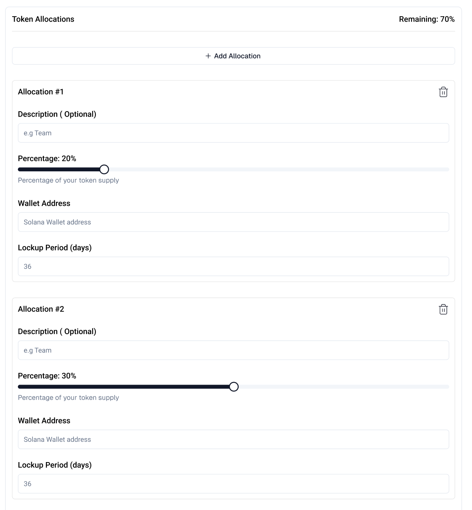

# Token Allocation

The allocation section allows you to define how your token supply will be distributed among different stakeholders or purposes. Proper allocation is crucial for your token's economics and governance.

## Allocation Configuration 

Each allocation entry consists of the following fields:

| Field | Description | Example/Format | Notes |
|-------|-------------|----------------|-------|
| Description | Optional label to identify the allocation purpose | "Team", "Marketing", "Treasury" | Helps organize and track different allocations |
| Percentage | Portion of total token supply for this allocation | 20% (slider control) | • Must be between 1-100% • All allocations must sum to 100% |
| Wallet Address | Recipient address for the tokens | public key format | Must be a valid network wallet address |
| Lockup Period | Duration tokens remain locked after distribution | 36 days | • Minimum: 0 days • Recommended: 180+ days for team allocations |

:::tip
You can create multiple allocations by clicking the "Add Allocation" button. Use the trash icon (🗑️) to remove any unwanted allocations.
:::
