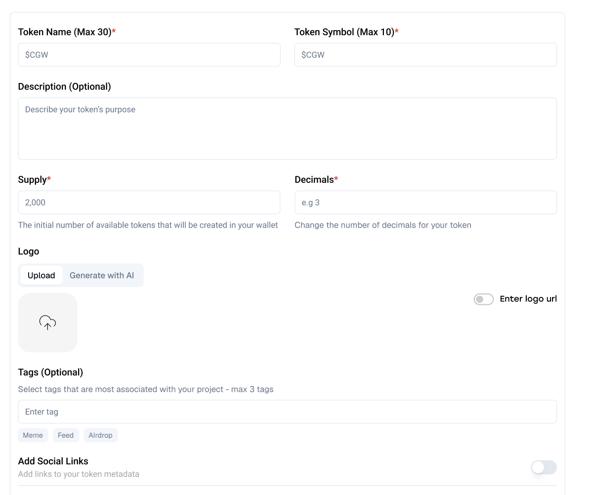
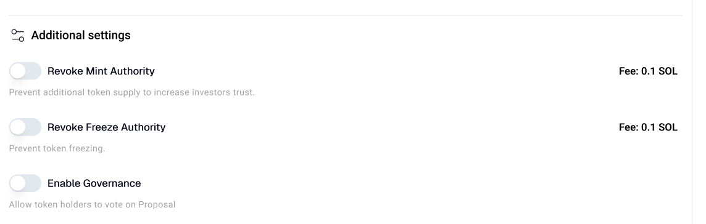

# Basic Information

## 1. Deploy Token

The following table explains the essential parameters needed to deploy your token:

| Parameter | Description | Recommendation |
|-----------|-------------|----------------|
| Token Name | The full name of your token | • Maximum 30 characters • Should be unique and memorable • Example: "My Sample Token" |
| Token Symbol | Short abbreviation for your token | • Maximum 10 characters • Keep it short (2-5 characters) • Example: "MST" |
| Supply | Initial total number of tokens to be created | • Determines maximum supply if mint authority is revoked • Consider your tokenomics carefully |
| Decimals | Number of decimal places for token division | • 6-9 decimals for standard tokens • 2-3 decimals for less divisible tokens • 9+ decimals for high-value tokens |
| Logo | Visual identifier for your token | • Square format (1:1 ratio) • Minimum 200x200px (512x512px recommended) • Maximum 5MB size |
| Social Links | Enhance your token's credibility by adding social media links to your token's metadata: website, telegram, twitter,discord, ... | |

## 2. Additional Settings

Configure advanced settings for your token:

| Setting | Description | Impact |
|---------|-------------|---------|
| Revoke Mint | Permanently removes ability to mint new tokens | • Makes total supply fixed • Cannot be reversed • Increases token security |
| Revoke Freeze | Removes ability to freeze token accounts | • Increases token transferability • Cannot be reversed • Reduces control over malicious actors |
| Enable Governance | Activates governance features for token | • Allows community voting • Enables proposal creation • Supports decentralized decision-making |

Once you've configured all settings, click "Next" to proceed with the token deployment. 