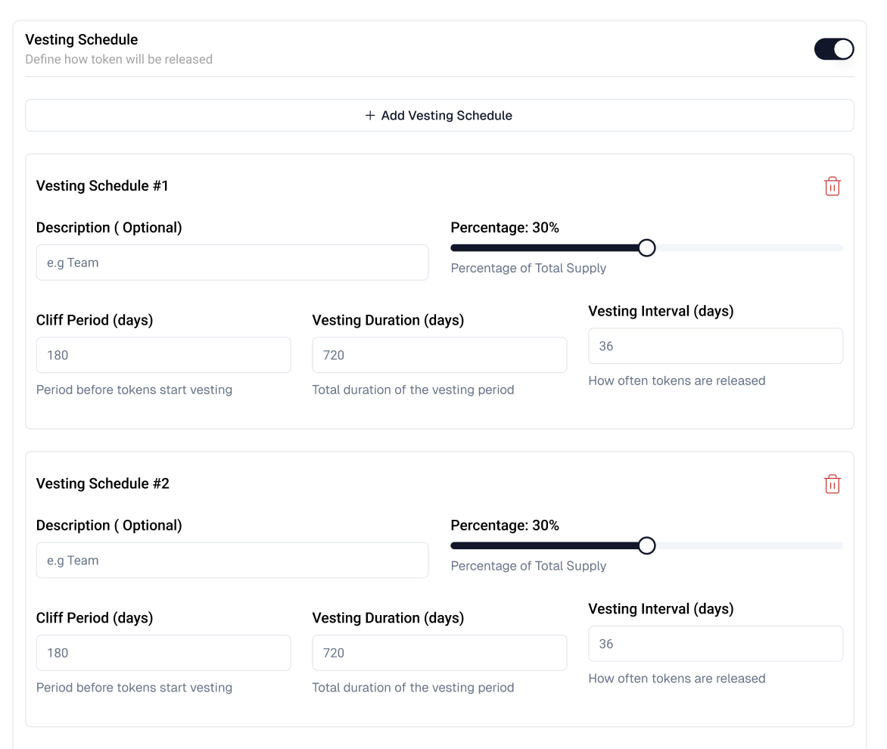

# Vesting Schedule

The vesting schedule determines how allocated tokens are released over time. This is particularly important for team tokens, investor allocations, and other stakeholders to ensure long-term commitment to the project.

## Vesting Schedule Configuration

Each vesting schedule consists of the following parameters:

| Field | Description | Example | Notes |
|-------|-------------|---------|-------|
| Description | Optional label to identify the vesting purpose | "Team Vesting", "Advisor Tokens" | Helps track different vesting schedules |
| Percentage | Portion of total supply for this vesting schedule | 30% (slider control) | • Must be between 1-100% • All schedules must sum to 100% |
| Cliff Period | Initial lockup before tokens begin vesting | 180 days | • Period before any tokens are released • Recommended: 180+ days for team |
| Vesting Duration | Total time period for token release | 720 days | • Must be longer than cliff period • Longer periods show stronger commitment |
| Vesting Interval | Frequency of token releases | 36 days | • How often tokens unlock • Common: 30 days for monthly releases |

:::tip
You can create multiple vesting schedules by clicking "Add Vesting Schedule". Use the trash icon (🗑️) to remove unwanted schedules.
:::
