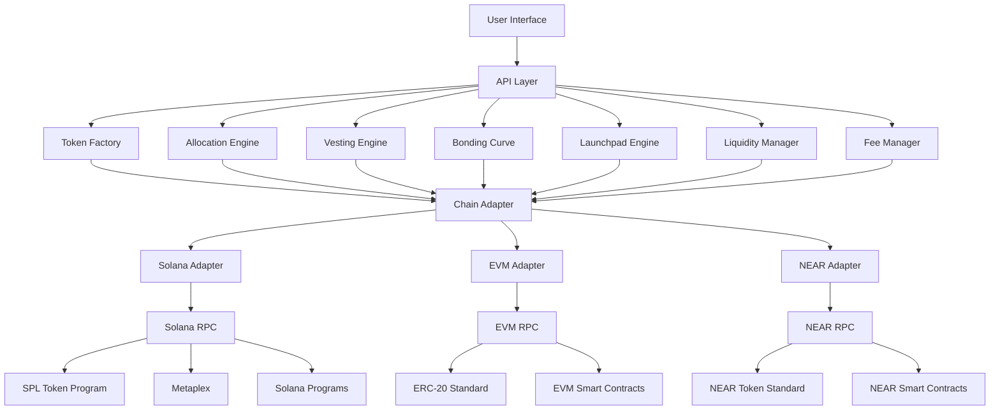
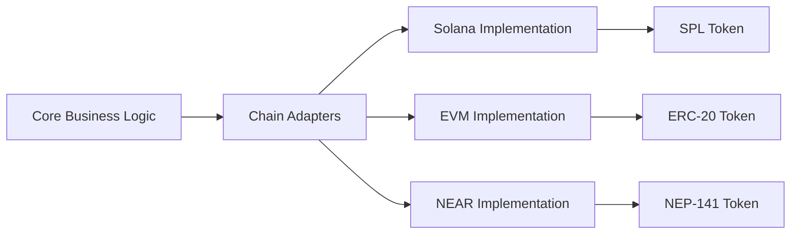

# Architectural Overview

The Fair LaunchPad platform provides a comprehensive multi-chain solution for creating and launching tokens without coding. This document explains the system architecture and how the various components interact across different blockchain ecosystems.

## System Architecture

## Cross-Chain Architecture

The Fair LaunchPad uses a modular architecture with blockchain-specific adapters to support multiple chains:

