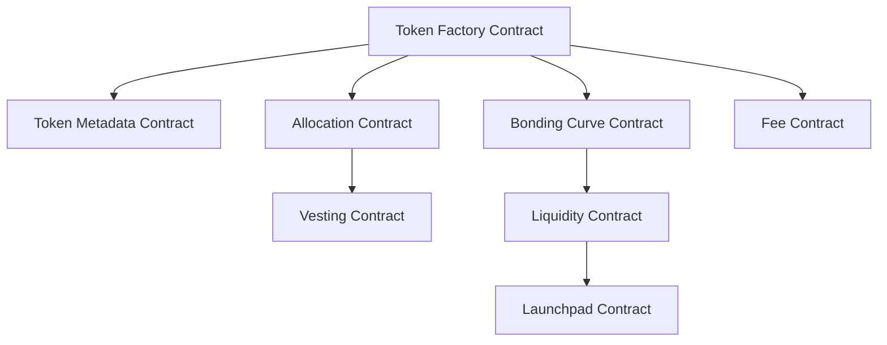
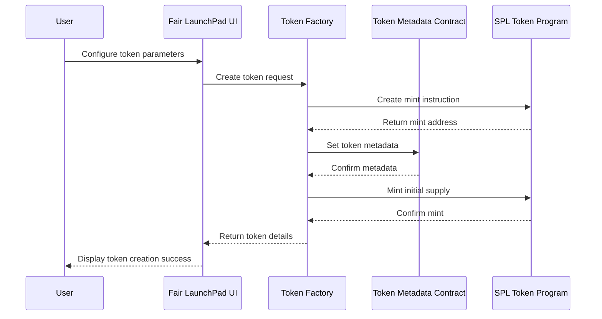
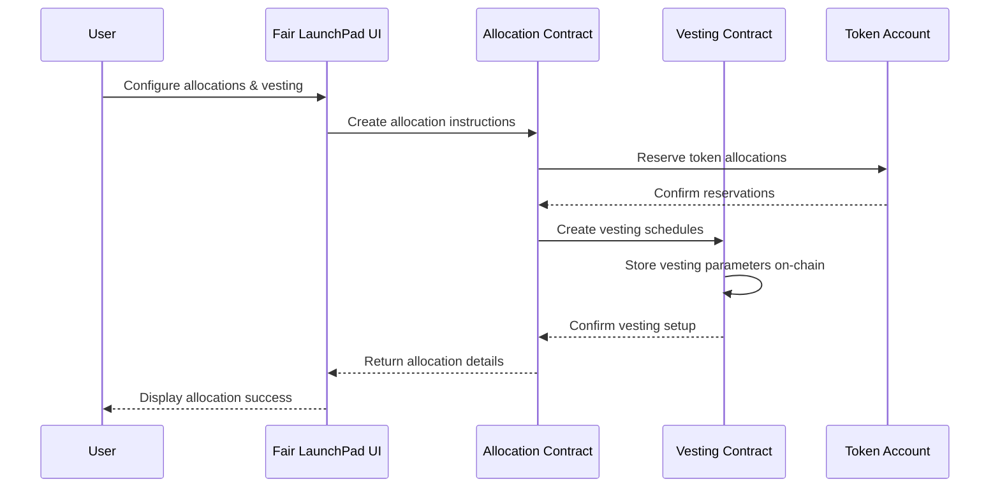
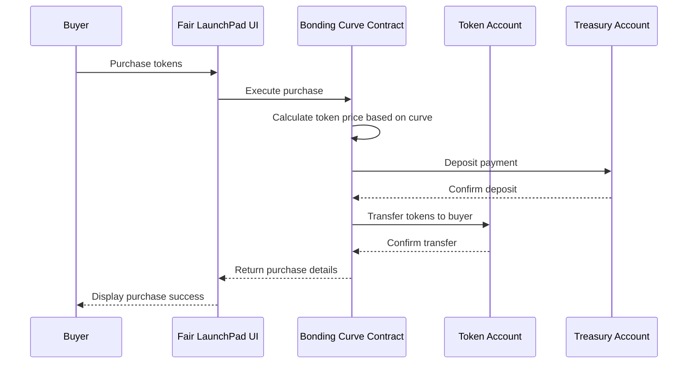
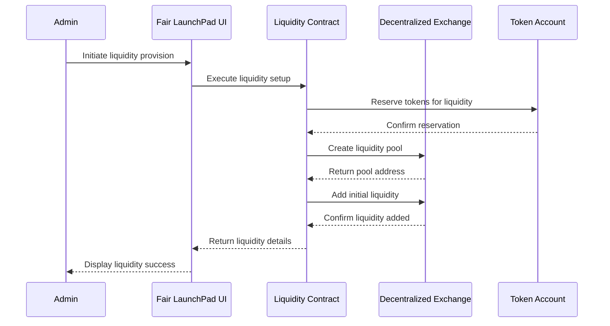
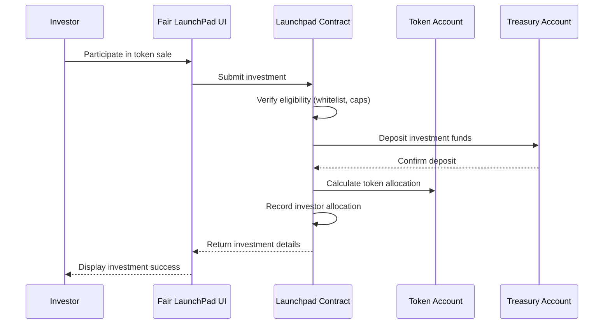
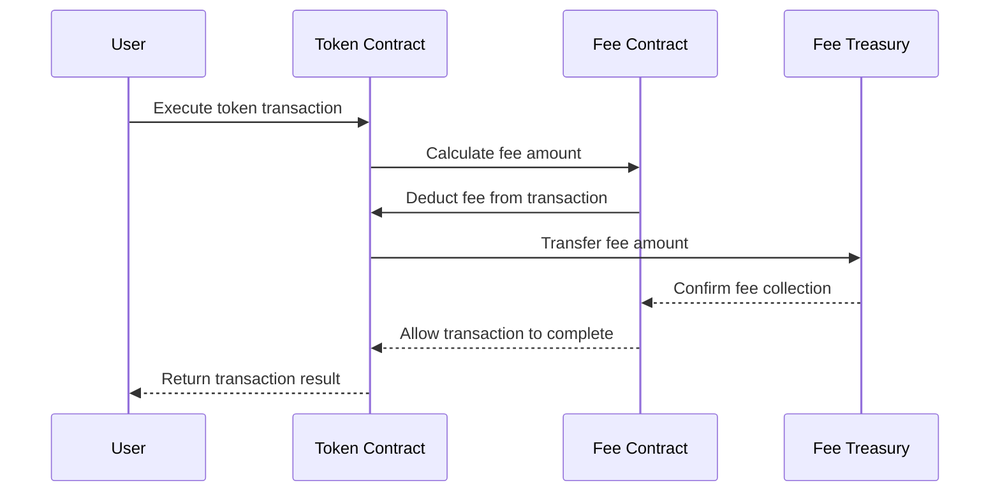
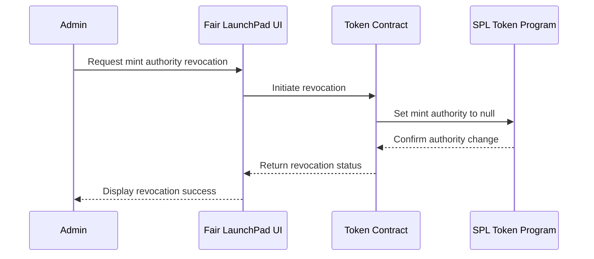
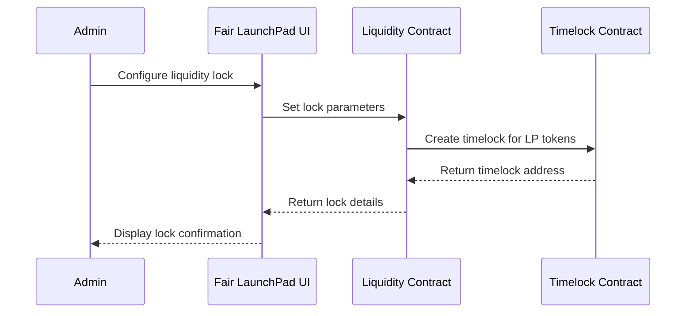

# Solana

The Fair LaunchPad platform is built on a series of Solana smart contracts that handle token creation, allocation, vesting, bonding curves, and liquidity provision. This document explains the technical architecture and contract interactions that power the platform.

## Contract Architecture Overview

The Fair LaunchPad system consists of several interconnected smart contracts that work together to provide a complete token launch solution:

## Token Creation Flow

When a user creates a new token through the Fair LaunchPad interface, the following sequence of contract interactions occurs:

## Allocation and Vesting Flow

When configuring token allocations and vesting schedules:

## Bonding Curve Mechanism

The bonding curve contract manages token price discovery:

## Liquidity Provision Flow

When the token is ready for DEX listing:

## Launchpad Sale Flow

The public token sale process:

## Fee Management Flow

The fee collection mechanism:

## Security Features

The Fair LaunchPad contracts implement several security features:

### Mint Authority Revocation

### Liquidity Locking

## Technical Specifications

The Fair LaunchPad contracts are built with the following technical specifications:

- **Language**: Rust
- **Framework**: Anchor
- **Token Standard**: SPL Token
- **Metadata Standard**: Metaplex
- **State Management**: Account-based storage with PDAs
- **Security**: Program-derived addresses for secure cross-program invocation

## Contract Addresses

| Program | Devnet Address | Mainnet Address |
|----------|----------------|-----------------|
| Vesting | `5FtaV9dQwBq9s9PiGEUfGk6SbvRQtwqyzF8Ycc7i6YGv` |  |
| Bonding Curve | `4FtaV9dQwBq9s9PiGEUfGk6SbvRQtwqyzF8Ycc7i6YGv` |  |
| Liquidity | `3FtaV9dQwBq9s9PiGEUfGk6SbvRQtwqyzF8Ycc7i6YGv` |  |
| Launchpad | `2FtaV9dQwBq9s9PiGEUfGk6SbvRQtwqyzF8Ycc7i6YGv` |  |
| Fee | `1FtaV9dQwBq9s9PiGEUfGk6SbvRQtwqyzF8Ycc7i6YGv` |  |

## Audit Status

