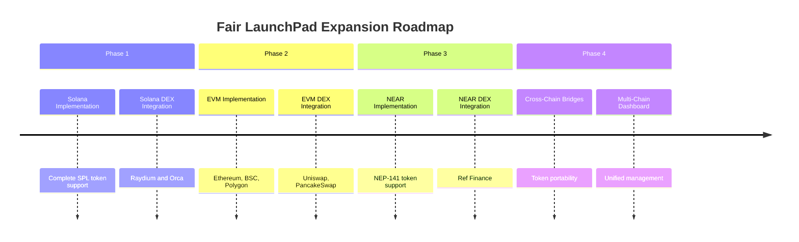

## Cross-Chain Future Roadmap

While the current implementation focuses on Solana, the modular architecture allows for future expansion:

This architectural overview provides a comprehensive understanding of how the Fair LaunchPad works on Solana, with a roadmap for future multi-chain expansion.

